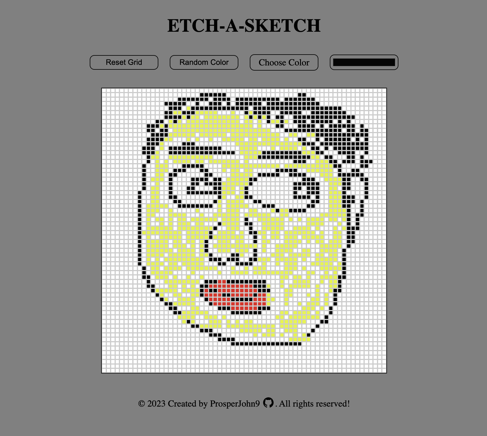

# Etch A Sketch
Etch-a-sketch project created using html,css and javascript. 

Live Demo:
https://prosperjohn9.github.io/etch-a-sketch/

Desktop View:

This project was created for the [Etch-A-Sketch](https://www.theodinproject.com/lessons/foundations-etch-a-sketch) assignment as part of The Odin Project curriculum.

# Objectives
1. Website with 16x16 grid of square elements.
2. Change color of each on mouse-over.
3. Adjustable grid size, no larger than 100x100.
4. Option to use random color per pixel.